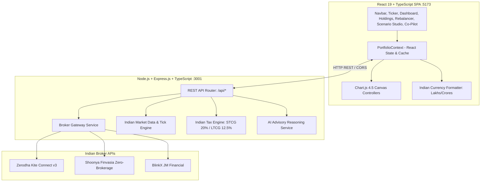

# Technical Specification Document — Portfolio Advisor

**Architecture:** Distributed Client-Server SPA (React 19 + TypeScript + Express.js Node Backend)  
**Location:** `/Users/rahulsharma/Documents/coding/myapps/portfolio-advisor`  
**Frontend Port:** `5173` | **Backend Port:** `3001`  

---

## 1. System Architecture Diagram



---

## 2. Directory & Module Structure

```
portfolio-advisor/
├── index.html                     # HTML5 Shell with Google Fonts & SEO Meta
├── package.json                   # Frontend dependencies (React 19, Chart.js, Lucide)
├── tsconfig.json                  # Frontend TS configuration
├── vite.config.ts                 # Vite bundler configuration
├── src/
│   ├── types/index.ts             # Core domain models & interfaces
│   ├── styles/index.css           # Design tokens, cyber-fintech dark theme, glassmorphism
│   ├── utils/
│   │   ├── chartSetup.ts          # Global Chart.js element registrations
│   │   └── indianCurrency.ts      # Indian numbering format (₹, Lakhs, Crores)
│   ├── services/
│   │   ├── marketData.ts          # Frontend Indian market feed & subscriptions
│   │   └── advisorEngine.ts       # Quantitative scoring, drift rebalancing, Monte Carlo, stress tests
│   ├── data/presets.ts            # Indian investor strategy templates (Nifty Titans, Dalio All-Weather)
│   ├── context/PortfolioContext.tsx # Central state management & backend broker bindings
│   ├── components/
│   │   ├── Header.tsx             # Live ticker tape, portfolio switcher, broker connect button
│   │   ├── Navigation.tsx         # Tab navigation with dynamic badges
│   │   ├── PortfolioOverview.tsx  # Metrics cards, growth trajectory chart, asset doughnut
│   │   ├── HoldingsTable.tsx      # Multi-asset table, 7-day sparklines, tax-lot accordion
│   │   ├── RecommendationHub.tsx  # Health score radar, visual allocation sliders, 1-click rebalance
│   │   ├── ScenarioStudio.tsx     # 10-year Monte Carlo wealth fan chart, Indian macro stress-tests
│   │   ├── MarketPulse.tsx        # Benchmark indices, Fear & Greed gauge, news sentiment
│   │   ├── AICoPilot.tsx          # Interactive financial assistant chat
│   │   └── Modals/
│   │       ├── AddTransactionModal.tsx  # Manual buy/sell/dividend/deposit entry
│   │       ├── CreatePortfolioModal.tsx # New portfolio wizard
│   │       ├── ImportExportModal.tsx    # JSON/CSV backup and restore
│   │       ├── AssetDetailModal.tsx     # Historical candlestick chart & fundamentals
│   │       └── BrokerConnectModal.tsx   # Zerodha, Shoonya, BlinkX authentication & 1-click sync
│   ├── App.tsx                    # Root container orchestration
│   └── main.tsx                   # React 19 bootstrap mount
│
└── server/                        # Dedicated Node.js / Express Backend
    ├── package.json               # Backend dependencies (Express, CORS, Axios, CryptoJS)
    ├── tsconfig.json              # Backend TypeScript config (NodeNext)
    ├── dist/                      # Compiled JS output
    └── src/
        ├── index.ts               # Express REST API routes
        ├── types/index.ts         # Backend broker and tax data contracts
        └── services/
            ├── brokerGateway.ts   # Zerodha Kite, Shoonya, BlinkX connectors + Sandbox
            ├── indianMarketData.ts# Real-time tick engine for NSE/BSE stocks & indices
            └── indianTaxEngine.ts # Section 111A (STCG) & 112A (LTCG) calculation
```

---

## 3. Core Data Contracts (`src/types/index.ts`)

```typescript
export type AssetClass = 'stocks' | 'crypto' | 'etfs' | 'bonds' | 'commodities' | 'cash' | 'real_estate';

export interface Holding {
  id: string;
  symbol: string;
  name: string;
  assetClass: AssetClass;
  sector: string;
  quantity: number;
  avgBuyPrice: number;
  currentPrice: number;
  totalCost: number;
  currentValue: number;
  unrealizedPnL: number;
  unrealizedPnLPercent: number;
  allocationPercent: number;
  targetAllocationPercent: number;
  change24hPercent: number;
  dividendYield: number;
  annualDividendIncome: number;
  beta: number;
  sparkline: number[];
  lots: TransactionLot[];
}

export interface PortfolioMetrics {
  totalValue: number;
  totalCost: number;
  totalGainLoss: number;
  totalGainLossPercent: number;
  dayGainLoss: number;
  dayGainLossPercent: number;
  annualDividendIncome: number;
  portfolioYield: number;
  sharpeRatio: number;
  beta: number;
  volatility: number;
  healthScore: number;
  healthBreakdown: HealthBreakdown;
  assetClassWeights: Record<AssetClass, { value: number; percent: number }>;
  sectorWeights: Record<string, { value: number; percent: number }>;
}
```

---

## 4. Indian Broker Gateway Protocol

### 1. Zerodha Kite Connect v3
- **OAuth Checksum Authentication**:
  $$\text{Checksum} = \text{SHA256}(\text{api\_key} + \text{request\_token} + \text{api\_secret})$$
- **Access Token Exchange**:
  `POST https://api.kite.trade/session/token` with headers `X-Kite-Version: 3`.
- **Holdings Extraction**:
  `GET https://api.kite.trade/portfolio/holdings` returning `tradingsymbol`, `isin`, `quantity`, `t1_quantity`, `average_price`, `last_price`, `pnl`, and `day_change`.

### 2. Shoonya (Finvasia)
- **Zero-Brokerage API Protocol**:
  Uses `QuickAuth` session handshake with `User ID`, `Password Hash`, and `2FA TOTP` payload.
- **Holdings & Positions Endpoint**:
  Retrieves Demat delivery equity holdings and margin limits.

### 3. BlinkX by JM Financial
- **Session Token Interface**:
  Authenticates client Demat ID and returns structured portfolio composition for real-time risk checking.

---

## 5. Quantitative Algorithms & Mathematical Formulations

### 1. Diversification Score via Herfindahl-Hirschman Index (HHI)
$$\text{HHI} = \sum_{i=1}^{N} \left(\frac{V_i}{V_{\text{total}}} \times 100\right)^2$$
$$\text{Score}_{\text{diversification}} = \max\left(20, \min\left(100, 100 - \frac{\text{HHI}}{100}\right)\right)$$

### 2. Risk-Adjusted Sharpe Ratio
$$S = \frac{R_p - R_f}{\sigma_p}$$
*Where:*
* $R_f = 6.5\%$ (RBI Sovereign Repo Rate)
* $R_p = 12\% + (\beta_p - 1) \times 4\%$ (Capital Asset Pricing Model return)
* $\sigma_p = 14\% \times \max(0.7, \beta_p)$ (Portfolio volatility)

### 3. Zero-Drift Rebalancing Engine
For each asset class $k \in \{\text{stocks, etfs, bonds, commodities, cash, real\_estate}\}$:
$$\Delta V_k = (V_{\text{total}} \times T_k) - C_k$$
*If $\Delta V_k > 0$ (Underweight):*
$$\text{Shares to BUY} = \left\lfloor \frac{\Delta V_k}{P_{\text{asset}}} \right\rfloor$$
*If $\Delta V_k < 0$ (Overweight):*
$$\text{Shares to SELL} = \min\left(Q_{\text{owned}}, \left\lfloor \frac{|\Delta V_k|}{P_{\text{asset}}} \right\rfloor\right)$$

### 4. 10-Year Monte Carlo Stochastic Wealth Forecaster
Models geometric Brownian motion (GBM) with monthly capital contributions across 1,000 statistical runs:
$$S_{t+\Delta t} = S_t \exp\left[\left(\mu - \frac{1}{2}\sigma^2\right)\Delta t + \sigma \sqrt{\Delta t} Z\right] + \text{SIP}_{\text{monthly}}$$
*Where $Z \sim \mathcal{N}(0, 1)$ generated via Box-Muller transformation.*

### 5. Indian Capital Gains Tax Engine (Union Budget 2024 Provisions)
- **Short-Term Capital Gains (Section 111A)**:
  $$\text{Tax}_{\text{STCG}} = \sum \max(0, \text{STCG}_i) \times 20\%$$
- **Long-Term Capital Gains (Section 112A)**:
  $$\text{Taxable LTCG} = \max(0, \sum \text{LTCG}_i - ₹1,25,000)$$
  $$\text{Tax}_{\text{LTCG}} = \text{Taxable LTCG} \times 12.5\%$$
- **Tax-Loss Harvesting Savings**:
  $$\text{Savings} = \text{Loss}_{\text{short-term}} \times 20\% + \text{Loss}_{\text{long-term}} \times 12.5\%$$

---

## 6. Backend REST API Specifications

| Method | Endpoint | Description | Request Payload | Response Sample |
|---|---|---|---|---|
| `GET` | `/api/health` | Server uptime & market status | None | `{"status": "ok", "market": "India"}` |
| `GET` | `/api/market/assets` | Real-time Indian asset universe | None | `{"success": true, "assets": {...}}` |
| `GET` | `/api/market/indices` | NIFTY, SENSEX, BANK NIFTY, VIX, MCX Gold | None | `{"success": true, "indices": [...]}` |
| `GET` | `/api/market/news` | Curated Indian market sentiment news | None | `{"success": true, "news": [...]}` |
| `GET` | `/api/brokers/sessions` | Active broker connection statuses | None | `{"sessions": [{"broker": "zerodha", "connected": true}]}` |
| `POST` | `/api/brokers/connect/zerodha` | Authenticate Zerodha Kite Connect | `{ apiKey, apiSecret, requestToken }` | `{"success": true, "session": {...}}` |
| `POST` | `/api/brokers/connect/shoonya` | Authenticate Shoonya Finvasia | `{ userId, password, twoFA, apiKey }` | `{"success": true, "session": {...}}` |
| `POST` | `/api/brokers/connect/blinkx` | Authenticate BlinkX JM Financial | `{ clientCode, apiKey }` | `{"success": true, "session": {...}}` |
| `GET` | `/api/brokers/:broker/holdings` | Fetch Demat holdings from broker | None | `{"success": true, "holdings": [...]}` |
| `POST` | `/api/brokers/:broker/order` | Execute rebalancing trade order | `{ tradingsymbol, transaction_type, quantity }` | `{"success": true, "order_id": "ORD-123"}` |
| `POST` | `/api/advisor/tax-analysis` | Indian STCG/LTCG breakdown | `{ holdings: [...] }` | `{"taxSummary": {...}}` |
| `POST` | `/api/ai/chat` | AI Financial Advisor Co-Pilot | `{ message: "...", context: {...} }` | `{"response": "...", "timestamp": "..."}` |

---

## 7. Extensibility Guidelines for Future Developers

1. **Adding a New Indian Broker Connector**:
   - Create a connector method in `server/src/services/brokerGateway.ts`.
   - Add the broker ID to `BrokerType` in `server/src/types/index.ts`.
   - Expose the connect route in `server/src/index.ts` and add tab to `src/components/Modals/BrokerConnectModal.tsx`.
2. **Adding New NSE/BSE Assets or Mutual Funds**:
   - Add asset metadata to `INDIAN_ASSETS` in `server/src/services/indianMarketData.ts` and `src/services/marketData.ts`.
3. **Updating Indian Tax Slabs (Future Union Budgets)**:
   - Modify `STCG_RATE`, `LTCG_RATE`, and `LTCG_EXEMPTION_LIMIT` in `server/src/services/indianTaxEngine.ts` and `src/components/RecommendationHub.tsx`.
